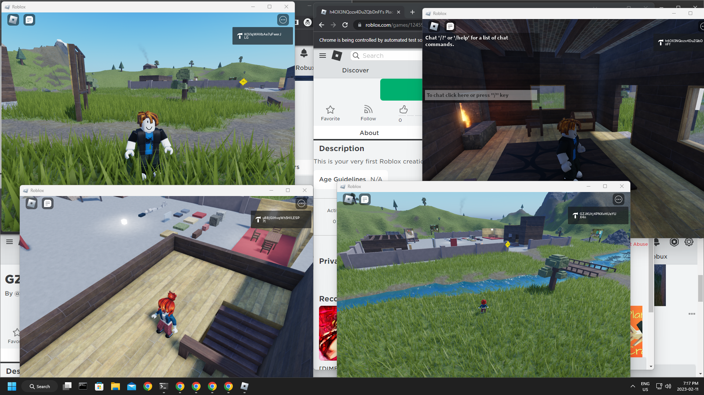

# Roblox Multi Instance

Allows you to open multiple Roblox clients.

## Notes

Just compile then run `roblox_multi_instance.exe` and keep it open in the background.

All Roblox instances need to be closed before running this program. Otherwise, it will not work.
